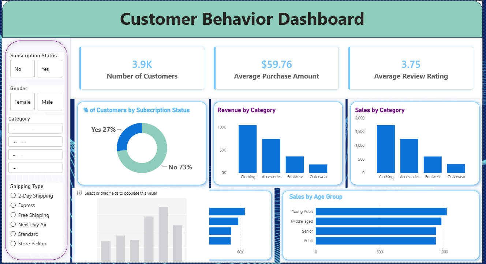

# Customer Shopping Behavior Analysis

## Overview

This project demonstrates an end-to-end Data Analytics workflow, from data preprocessing to business intelligence reporting. The analysis focuses on customer shopping behavior to uncover purchasing trends, customer segments, and actionable business insights.

The project includes data cleaning, exploratory data analysis (EDA) using Python, SQL-based business analysis with MySQL, interactive dashboard development in Power BI, comprehensive report writing, and presentation creation.

---

## Dataset

The dataset contains customer shopping transactions with information such as:

* Customer demographics
* Product categories
* Purchase amounts
* Discounts and subscriptions
* Shipping methods
* Customer ratings
* Purchase history

### Dataset Size

* **Rows:** 3,900
* **Columns:** 18

---

## Tools & Technologies

* **Python** (Pandas, NumPy, Matplotlib, Seaborn)
* **MySQL**
* **Power BI**
* **Jupyter Notebook**
* **Microsoft Word**
* **Gamma**

---

## Project Workflow

### 1. Data Loading

* Imported the dataset into Python.
* Explored the dataset structure using Pandas.
* Generated summary statistics and identified data types.

### 2. Exploratory Data Analysis (EDA)

* Analyzed customer demographics.
* Examined purchasing behavior and spending patterns.
* Visualized distributions and relationships using Matplotlib and Seaborn.
* Identified trends across product categories and customer segments.

### 3. Data Cleaning

* Handled missing values.
* Renamed columns for consistency.
* Removed duplicate and unnecessary columns.
* Created additional features for enhanced analysis.

### 4. SQL Analysis (MySQL)

Imported the cleaned dataset into MySQL and performed business analysis using SQL queries, including:

* Revenue by gender
* Revenue by age group
* Top-performing product categories
* Customer segmentation
* Subscription analysis
* Shipping method analysis
* Discount impact on purchases
* Purchase frequency analysis

### 5. Power BI Dashboard

Developed an interactive dashboard containing:

* Sales Overview
* Revenue KPIs
* Customer Demographics
* Product Performance
* Subscription Insights
* Purchase Trends
* Interactive slicers and filters

### 6. Reporting & Presentation

* Documented the complete data analysis workflow.
* Summarized key business insights.
* Provided actionable recommendations.
* Created a professional presentation for stakeholders.

---

## Dashboard Highlights

The interactive Power BI dashboard includes:

* Sales & Revenue KPIs
* Customer Segmentation
* Product Category Performance
* Purchase Behavior Analysis
* Subscription Insights
* Revenue Trends
* Interactive Filters & Slicers

---

## Key Insights

* Identified the highest revenue-generating product categories.
* Analyzed customer purchasing behavior across different age groups and genders.
* Compared subscriber and non-subscriber spending patterns.
* Evaluated the impact of discounts on customer purchases.
* Identified customer segments based on purchase history.
* Generated business recommendations to improve customer retention, sales, and profitability.

---

## Project Structure

```text
Customer-Shopping-Behavior-Analysis/
│
├── Dataset/
├── Python_EDA/
├── SQL_Queries/
├── PowerBI_Dashboard/
├── Report/
├── Presentation/
├── README.md
└── requirements.txt
```

---

## Dashboard Preview
<h2>Dashboard Preview</h2>



```text
PowerBI_Dashboard/
└── dashboard.png
```

---

## How to Run

1. Clone this repository.

```bash
git clone https://github.com/Piyush7797/Customer-Shopping-Behavior-Analysis.git
```

2. Navigate to the project directory.

```bash
cd Customer-Shopping-Behavior-Analysis
```

3. Install the required Python libraries.

```bash
pip install -r requirements.txt
```

4. Open the Jupyter Notebook and run the EDA and data cleaning notebook.

5. Import the cleaned dataset into MySQL and execute the SQL queries.

6. Open the Power BI dashboard (`.pbix`) to explore interactive visualizations.

7. Review the project report and presentation for detailed business insights.

---

## Skills Demonstrated

* Data Cleaning
* Exploratory Data Analysis (EDA)
* SQL Query Writing
* Data Visualization
* Dashboard Development
* Business Intelligence
* Business Analytics
* Data Storytelling
* Power BI
* MySQL
* Python
* Pandas
* NumPy
* Matplotlib
* Seaborn

---

## Future Improvements

* Customer Lifetime Value (CLV) Analysis
* Customer Churn Prediction
* Sales Forecasting
* Customer Recommendation System
* Interactive Web Dashboard using Streamlit
* Machine Learning-based Customer Segmentation

---

## Author

### **Piyush Vishvakarma**

**Data Analyst | Data Scientist | Machine Learning Enthusiast**

📍 Indore, Madhya Pradesh, India

* **Email:** [piyushvishvakrma7797@gmail.com](mailto:piyushvishvakrma7797@gmail.com)
* **LinkedIn:** https://www.linkedin.com/in/piyush-vishvakrma1115/
* **GitHub:** https://github.com/Piyush7797

If you found this project helpful, feel free to ⭐ star the repository and connect with me on LinkedIn. Feedback and contributions are always welcome!
